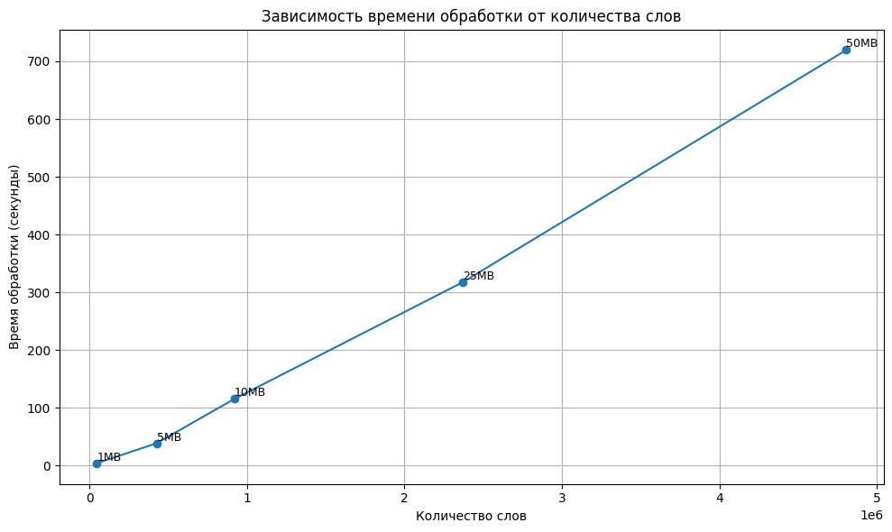

1MB:

```json
{
  "all": 1,
  "received": 1,
  "stats": {
    "word_count": 46937,
    "bad_words": 120,
    "names": 0,
    "top_5": [
      ["the", 1403],
      ["of", 1232],
      ["in", 734],
      ["regiment", 557],
      ["and", 509]
    ],
    "start_time": "2025-11-24T07:21:32.133332195Z",
    "end_time": "2025-11-24T07:21:35.848831+00:00",
    "time_spent": 3.715499,
    "sentiment": "0.26%"
  }
}
```

5MB:

```json
{
  "all": 1,
  "received": 1,
  "stats": {
    "word_count": 426646,
    "bad_words": 219,
    "names": 0,
    "top_5": [
      ["in", 23988],
      ["football", 21153],
      ["season", 19157],
      ["election", 12981],
      ["team", 11817]
    ],
    "start_time": "2025-11-24T07:21:32.194641601Z",
    "end_time": "2025-11-24T07:22:10.662492+00:00",
    "time_spent": 38.467851,
    "sentiment": "0.05%"
  }
}
```

10MB:

```json
{
  "all": 1,
  "received": 1,
  "stats": {
    "word_count": 922325,
    "bad_words": 310,
    "names": 0,
    "top_5": [
      ["football", 58225],
      ["season", 56843],
      ["in", 35777],
      ["team", 31948],
      ["election", 24110]
    ],
    "start_time": "2025-11-24T07:21:32.244855049Z",
    "end_time": "2025-11-24T07:23:27.679351+00:00",
    "time_spent": 115.434496,
    "sentiment": "0.03%"
  }
}

```

25MB:

```json
{
  "all": 1,
  "received": 1,
  "stats": {
    "word_count": 2369775,
    "bad_words": 982,
    "names": 0,
    "top_5": [
      ["season", 146116],
      ["football", 102064],
      ["team", 62324],
      ["in", 58487],
      ["election", 48394]
    ],
    "start_time": "2025-11-24T07:21:32.350424344Z",
    "end_time": "2025-11-24T07:26:49.545890+00:00",
    "time_spent": 317.195466,
    "sentiment": "0.04%"
  }
}
```

50 MB:

```json
{
  "all": 1,
  "received": 1,
  "stats": {
    "word_count": 4806259,
    "bad_words": 3564,
    "names": 0,
    "top_5": [
      ["season", 199007],
      ["football", 117440],
      ["team", 85217],
      ["in", 82153],
      ["basketball", 71496]
    ],
    "start_time": "2025-11-24T07:21:32.521128336Z",
    "end_time": "2025-11-24T07:33:32.043574+00:00",
    "time_spent": 719.522446,
    "sentiment": "0.07%"
  }
}

```
График зависимости времени от количества слов

